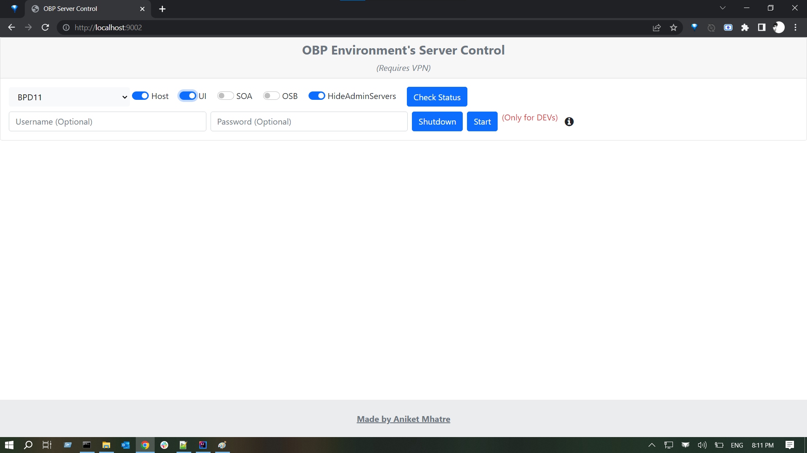
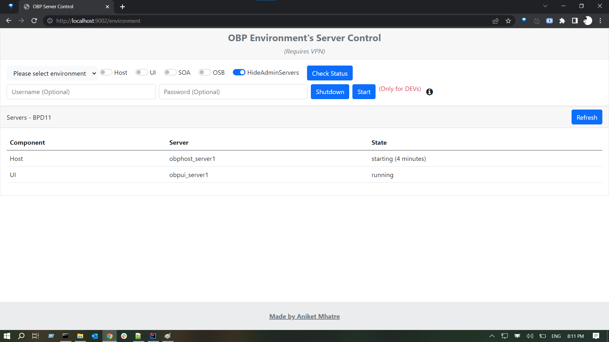
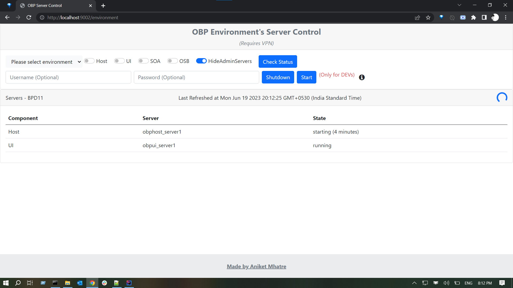
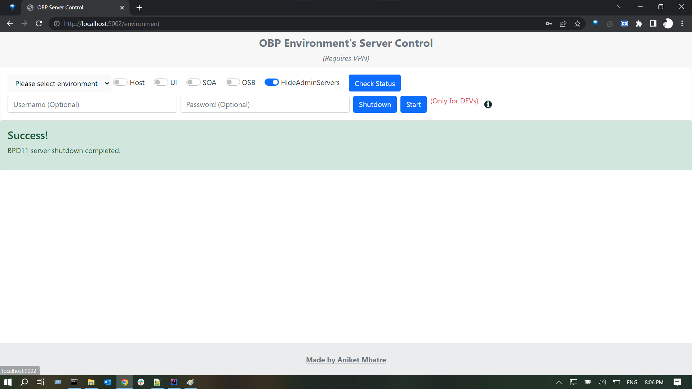
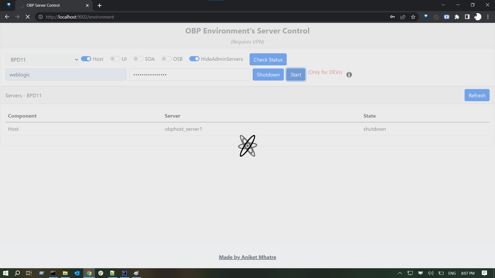
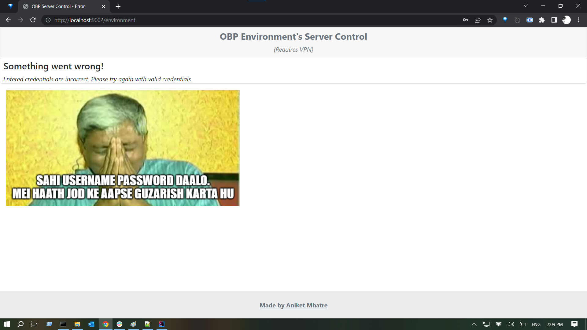
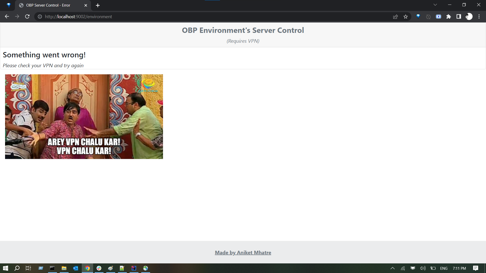
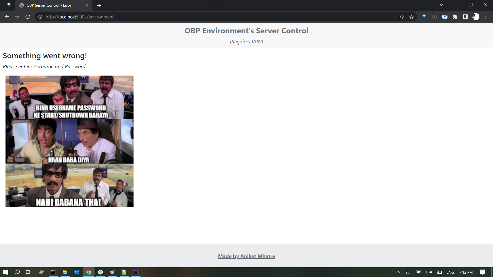

# Oracle-Weblogic-Server-Control
The application uses Oracle WebLogic Server API to control the servers activities, hosted on Oracle Fusion Middleware cloud platform.
One can do following things:
1. Check the current status of the server and its deployed components.
2. Start the component of particular server.
3. Shutdown the component of selected server.

# Screenshots

- Select the server and the component

- Can check the status of selected component and Refresh updates the status every 10 secs

- Start/shutdown server using weblogic username and password.
- 

- Error Handling
    

